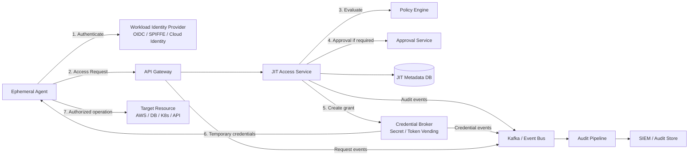
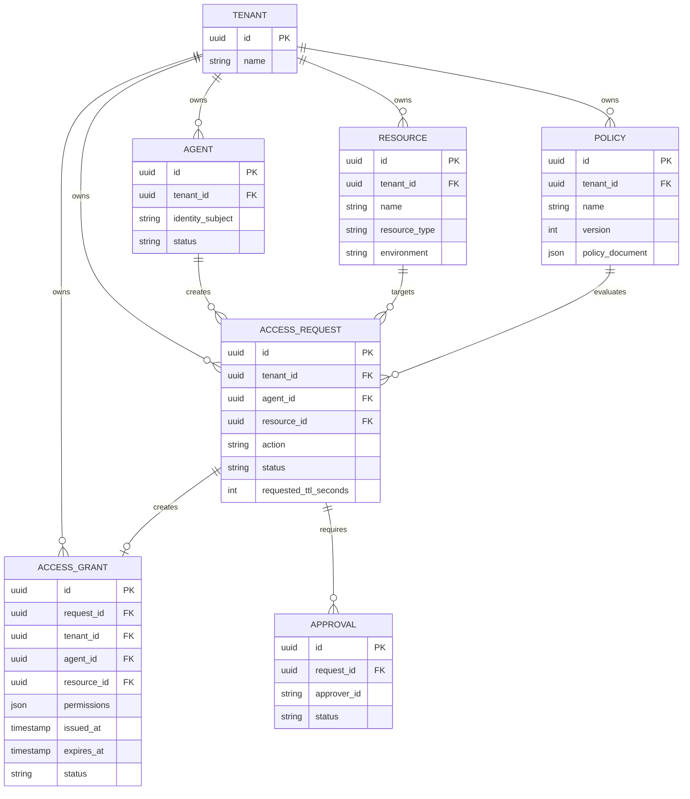
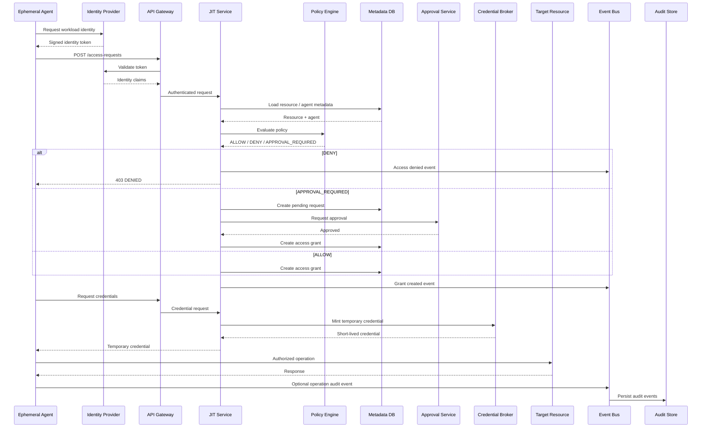
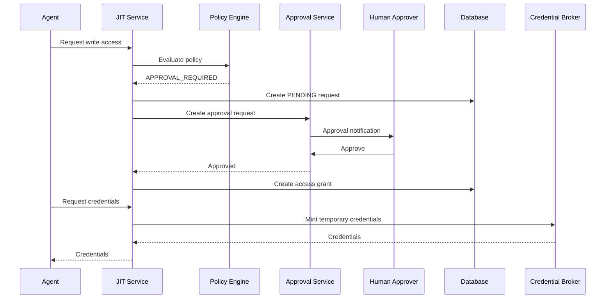
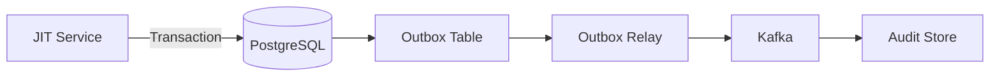
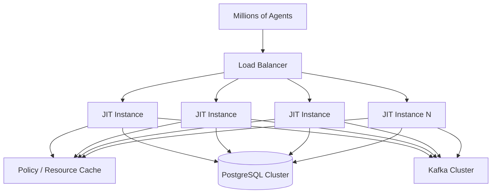
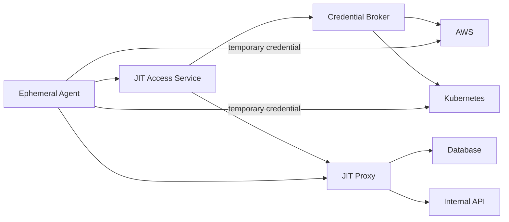
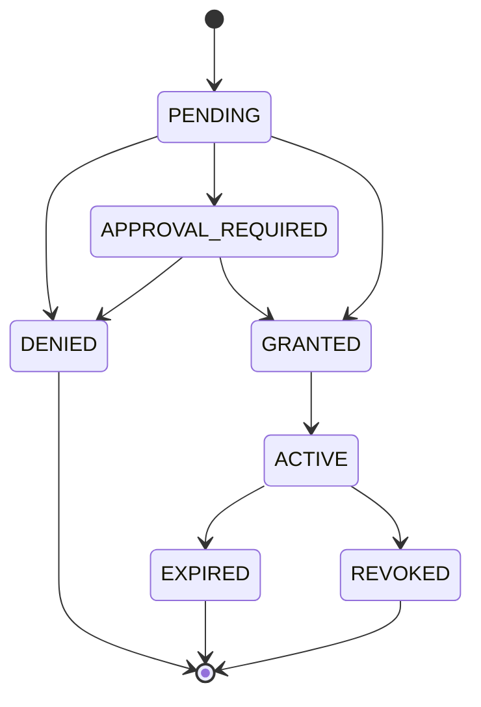
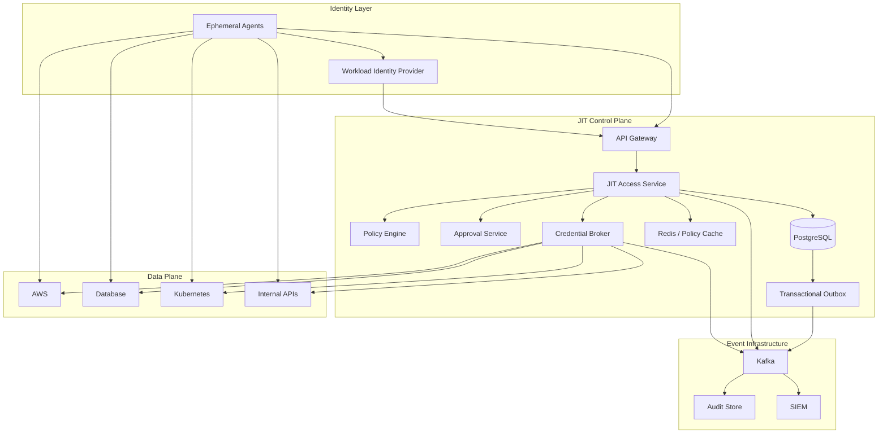
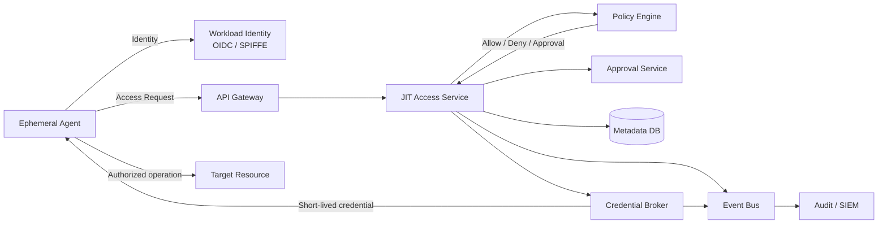

# Just-in-Time (JIT) Access System for Ephemeral Agents

## 1. Problem Definition

Our infrastructure processes a high volume of requests from various ephemeral agents.

These agents may need temporary access to sensitive resources such as:

* AWS resources
* Databases
* Kubernetes clusters
* Internal APIs
* Secrets
* Production services

The challenge is to provide agents with the **minimum permissions they need, only for the amount of time they need them**, without distributing long-lived credentials.

### Goals

The system should:

1. Authenticate the agent strongly.
2. Determine what resource the agent wants to access.
3. Evaluate whether the requested operation is allowed.
4. Enforce least privilege.
5. Provide short-lived credentials or access tokens.
6. Support human approval for sensitive operations.
7. Allow access to be revoked immediately.
8. Record an immutable audit trail.
9. Scale to a large number of ephemeral agents.
10. Avoid storing long-lived credentials.
11. Support multiple tenants and isolated policies.
12. Remain highly available.

### Non-Goals

The system is not responsible for:

* Implementing the underlying resource itself.
* Replacing the identity provider.
* Performing arbitrary business-level authorization inside every target service.
* Permanently storing agent credentials.

---

# 2. High-Level Architecture

The system is divided into a **control plane** and a **data plane**.

The control plane decides:

> "Is this agent allowed to access this resource, under what conditions, and for how long?"

The data plane performs:

> "Actually access the resource using the temporary authorization."



---

# 3. Why We Need a JIT System

The traditional approach is to give agents long-lived credentials.

For example:

```text
Agent
   |
   | AWS_ACCESS_KEY_ID
   | AWS_SECRET_ACCESS_KEY
   v
AWS
```

This creates several problems:

* Credentials can leak.
* Credentials may remain valid after the agent terminates.
* Permissions are often broader than necessary.
* Rotation becomes difficult.
* It becomes difficult to determine exactly why access occurred.
* Revocation is slow.
* Compromised credentials can be reused.

Instead:

```text
Agent
   |
   | Workload Identity
   v
JIT System
   |
   | Short-lived credential
   v
Resource
```

The credential might only be valid for 5–15 minutes.

---

# 4. Identity Model

The most important security principle is:

> Never trust the identity supplied by the agent itself.

For example, the agent should not be able to simply send:

```json
{
  "agentId": "production-admin-agent"
}
```

Instead, the agent authenticates using a trusted workload identity mechanism.

Possible mechanisms include:

* OIDC
* SPIFFE/SPIRE
* Kubernetes service account identity
* AWS IAM workload identity
* Cloud workload identity
* mTLS certificates

The identity provider issues a signed identity token.

Example:

```text
Agent
  |
  | OIDC token
  v
API Gateway
  |
  | validate token
  v
JIT Service
```

The token should contain claims such as:

```json
{
  "sub": "agent-12345",
  "tenant": "tenant-a",
  "service": "deployment-agent",
  "environment": "production",
  "namespace": "payments"
}
```

The JIT service derives the identity from the validated token.

---

# 5. Multi-Tenancy

A tenant represents an isolated customer, organization, or security boundary.

For example:

```text
Tenant A
 ├── Agent A1
 ├── Agent A2
 └── Production DB

Tenant B
 ├── Agent B1
 ├── Agent B2
 └── Production DB
```

A tenant must never be able to access another tenant's resources.

Every important entity should therefore contain a `tenant_id`.

Examples:

```text
agents
resources
policies
access_requests
access_grants
approvals
```

The authorization layer must verify:

```text
request.tenant_id == resource.tenant_id
```

before allowing access.

Tenant ID should come from authenticated identity rather than an arbitrary request parameter.

---

# 6. Control Plane vs Data Plane

This separation is important.

## Control Plane

Responsible for:

* Authentication
* Authorization
* Policy evaluation
* Approval
* Creating access grants
* Credential issuance
* Revocation
* Auditing

Components:

```text
API Gateway
     |
JIT Service
     |
Policy Engine
     |
Approval Service
     |
Credential Broker
```

## Data Plane

Responsible for actual resource access.

```text
Agent
   |
   | Temporary credential
   v
AWS / DB / Kubernetes / Internal API
```

The JIT service should not necessarily sit in the middle of every application request.

That would create a scalability bottleneck.

Instead, the JIT service authorizes access and provides a temporary credential.

---

# 7. Policy Model

Policies determine whether access is allowed.

A policy can contain:

```text
WHO
  Agent / workload identity

WHAT
  Resource

ACTION
  read / write / delete / deploy

WHEN
  Time restrictions

CONTEXT
  Environment
  IP
  Namespace
  Risk level

APPROVAL
  Whether human approval is required

TTL
  Maximum credential lifetime
```

Example:

```json
{
  "effect": "allow",
  "subject": {
    "service": "deployment-agent"
  },
  "resource": {
    "type": "database",
    "environment": "production"
  },
  "actions": [
    "read"
  ],
  "max_ttl_seconds": 900,
  "approval_required": false
}
```

Another policy:

```json
{
  "effect": "allow",
  "subject": {
    "service": "deployment-agent"
  },
  "resource": {
    "type": "database",
    "environment": "production"
  },
  "actions": [
    "write"
  ],
  "max_ttl_seconds": 300,
  "approval_required": true
}
```

---

# 8. Policy Evaluation

The policy engine evaluates:

```text
Identity
   +
Resource
   +
Requested Action
   +
Context
   +
Policy
```

Example:

```text
Agent:
  deployment-agent

Resource:
  production-payments-db

Action:
  write

Environment:
  production
```

Policy engine might return:

```json
{
  "decision": "ALLOW",
  "approval_required": true,
  "max_ttl_seconds": 300
}
```

Possible decisions:

```text
DENY
ALLOW
ALLOW_WITH_APPROVAL
```

The policy engine should be deterministic and versioned.

Every access decision should record the policy version used.

---

# 9. Database Design

The JIT metadata database stores authorization state, not long-lived secrets.

A relational database such as PostgreSQL is appropriate because the system needs:

* Transactions
* Strong consistency
* Relationships
* Unique constraints
* Audit metadata
* Queryability

---

## 9.1 agents

```sql
CREATE TABLE agents (
    id UUID PRIMARY KEY,
    tenant_id UUID NOT NULL,
    name VARCHAR(255) NOT NULL,
    identity_subject VARCHAR(500) NOT NULL,
    status VARCHAR(50) NOT NULL,
    created_at TIMESTAMP NOT NULL,
    updated_at TIMESTAMP NOT NULL,

    UNIQUE (tenant_id, identity_subject)
);
```

---

## 9.2 resources

```sql
CREATE TABLE resources (
    id UUID PRIMARY KEY,
    tenant_id UUID NOT NULL,
    name VARCHAR(255) NOT NULL,
    resource_type VARCHAR(100) NOT NULL,
    environment VARCHAR(100),
    endpoint VARCHAR(1000),
    created_at TIMESTAMP NOT NULL,

    UNIQUE (tenant_id, name)
);
```

Examples:

```text
production-payments-db
production-s3-bucket
production-kubernetes-cluster
```

---

## 9.3 policies

```sql
CREATE TABLE policies (
    id UUID PRIMARY KEY,
    tenant_id UUID NOT NULL,
    name VARCHAR(255) NOT NULL,
    version INTEGER NOT NULL,
    policy_document JSONB NOT NULL,
    status VARCHAR(50) NOT NULL,
    created_at TIMESTAMP NOT NULL,

    UNIQUE (tenant_id, name, version)
);
```

Policies should be immutable once published.

Instead of modifying version 5:

```text
Policy v5
Policy v6
Policy v7
```

This makes auditing easier.

---

## 9.4 access_requests

```sql
CREATE TABLE access_requests (
    id UUID PRIMARY KEY,
    tenant_id UUID NOT NULL,
    agent_id UUID NOT NULL,
    resource_id UUID NOT NULL,

    action VARCHAR(100) NOT NULL,

    status VARCHAR(50) NOT NULL,

    requested_ttl_seconds INTEGER,

    policy_id UUID,
    policy_version INTEGER,

    reason TEXT,

    created_at TIMESTAMP NOT NULL,
    updated_at TIMESTAMP NOT NULL,
    expires_at TIMESTAMP
);
```

Possible states:

```text
PENDING
APPROVAL_REQUIRED
APPROVED
DENIED
GRANTED
EXPIRED
REVOKED
```

---

## 9.5 access_grants

```sql
CREATE TABLE access_grants (
    id UUID PRIMARY KEY,
    request_id UUID NOT NULL,
    tenant_id UUID NOT NULL,

    agent_id UUID NOT NULL,
    resource_id UUID NOT NULL,

    permissions JSONB NOT NULL,

    issued_at TIMESTAMP NOT NULL,
    expires_at TIMESTAMP NOT NULL,

    status VARCHAR(50) NOT NULL,

    revoked_at TIMESTAMP
);
```

Important invariant:

```text
grant.expires_at <= policy.max_ttl
```

The agent cannot request a longer TTL than the policy allows.

---

## 9.6 approvals

```sql
CREATE TABLE approvals (
    id UUID PRIMARY KEY,
    request_id UUID NOT NULL,

    approver_id VARCHAR(255),
    status VARCHAR(50) NOT NULL,

    created_at TIMESTAMP NOT NULL,
    decided_at TIMESTAMP,

    reason TEXT
);
```

---

# 10. Database Relationship Diagram



---

# 11. API Design

## Request Access

```http
POST /v1/access-requests
Authorization: Bearer <workload-token>
Idempotency-Key: abc123
Content-Type: application/json
```

Request:

```json
{
  "resource_id": "resource-123",
  "action": "read",
  "requested_ttl_seconds": 600,
  "reason": "Investigating production issue"
}
```

Response:

```json
{
  "request_id": "request-123",
  "status": "GRANTED",
  "grant_id": "grant-456"
}
```

---

# 12. Get Access Request

```http
GET /v1/access-requests/{request_id}
```

Response:

```json
{
  "request_id": "request-123",
  "status": "APPROVED",
  "grant_id": "grant-456",
  "expires_at": "2026-09-25T15:10:00Z"
}
```

---

# 13. Retrieve Temporary Credentials

```http
POST /v1/access-grants/{grant_id}/credentials
Authorization: Bearer <workload-token>
```

Response:

```json
{
  "credential_type": "AWS_STS",
  "access_key_id": "temporary-key",
  "secret_access_key": "temporary-secret",
  "session_token": "temporary-token",
  "expires_at": "2026-09-25T15:10:00Z"
}
```

The credential should be generated just-in-time.

The JIT database should not store the secret.

---

# 14. Revoke Access

```http
POST /v1/access-grants/{grant_id}/revoke
```

Response:

```json
{
  "grant_id": "grant-456",
  "status": "REVOKED"
}
```

---

# 15. Complete Request Flow

This is the most important sequence to explain during the interview.



---

# 16. Detailed Request Processing

## Step 1: Agent Gets Identity

The ephemeral agent starts.

It authenticates using workload identity.

For example:

```text
Agent
  |
  | OIDC
  v
Identity Provider
```

The agent receives a short-lived identity token.

---

## Step 2: Agent Requests Access

The agent sends:

```http
POST /v1/access-requests
```

with:

```json
{
  "resource_id": "prod-db",
  "action": "read",
  "requested_ttl_seconds": 600
}
```

The agent does not specify its own identity.

---

# 17. Step 3: API Gateway Authentication

The API Gateway validates:

* Signature
* Issuer
* Audience
* Expiration
* Tenant
* Subject
* Required claims

Invalid tokens are rejected immediately.

---

# 18. Step 4: Resource Validation

JIT Service verifies:

```text
resource exists
resource belongs to tenant
resource is active
requested action is supported
```

For example:

```text
Agent tenant = Tenant A

Resource tenant = Tenant B

=> DENY
```

---

# 19. Step 5: Policy Evaluation

JIT Service sends the authorization context to the policy engine:

```json
{
  "subject": {
    "agent_id": "agent-123",
    "service": "deployment-agent"
  },
  "resource": {
    "id": "prod-db",
    "type": "database",
    "environment": "production"
  },
  "action": "read"
}
```

The policy engine returns:

```json
{
  "decision": "ALLOW",
  "max_ttl_seconds": 600
}
```

---

# 20. Step 6: Create Access Grant

The JIT service creates:

```text
Access Request
      |
      v
Access Grant
```

Example:

```text
Grant ID:
grant-123

Permissions:
database.read

Issued:
10:00:00

Expires:
10:10:00
```

The database transaction should ensure the request and grant are created atomically.

---

# 21. Step 7: Credential Vending

The agent asks for credentials.

The credential broker generates temporary credentials.

For AWS this could use STS-style temporary credentials.

For Kubernetes this might be:

```text
short-lived service account token
```

For a database:

```text
short-lived DB user/password
```

or a dynamically generated authentication token.

The important property is:

```text
Credential lifetime <= Grant lifetime
```

---

# 22. Step 8: Agent Uses Resource

The agent accesses the target directly.

For example:

```text
Agent
 |
 | temporary AWS credentials
 v
AWS
```

The JIT service does not need to proxy every request.

This keeps the data plane scalable.

---

# 23. Step 9: Expiration

Suppose:

```text
Grant:
10:00 - 10:10

Credential:
10:00 - 10:10
```

At 10:10:

```text
Credential invalid
Grant expired
```

The agent must request a new grant.

It cannot continue using the old credential.

---

# 24. Approval Flow

For sensitive operations, policy can require human approval.

Example:

```text
read production DB
    |
    v
automatic approval

delete production DB
    |
    v
human approval
```

Flow:



---

# 25. Why Approval Should Not Be in the Policy Engine

The policy engine should answer:

```text
Does this request require approval?
```

It should not manage the entire human workflow.

Separating them gives:

```text
Policy Engine
    |
    | approval_required=true
    v
Approval Service
```

This keeps authorization logic independent from workflow logic.

---

# 26. Revocation

There are two cases.

## Case 1: Credential supports immediate revocation

The credential broker can revoke the credential.

```text
Grant
  |
  v
Credential
  |
  X
Revoked
```

## Case 2: Credential cannot be revoked

Some credentials cannot be immediately invalidated.

In that situation, use:

* Very short TTL
* Resource-side deny lists where possible
* Proxy enforcement
* Session termination
* Credential rotation

The system should prefer credential types that support short TTLs and revocation.

---

# 27. Audit Architecture

Every important event should be audited.

Examples:

```text
ACCESS_REQUESTED
ACCESS_ALLOWED
ACCESS_DENIED
APPROVAL_REQUESTED
APPROVED
REJECTED
GRANT_CREATED
CREDENTIAL_ISSUED
CREDENTIAL_REVOKED
GRANT_EXPIRED
```

The JIT service should not synchronously depend on the audit database for every request.

Instead:

```text
JIT Service
     |
     v
Kafka / Event Bus
     |
     +----> Audit Store
     |
     +----> SIEM
     |
     +----> Security Analytics
```

---

# 28. Transactional Outbox

A potential problem is:

```text
DB transaction succeeds
Kafka publish fails
```

Now the grant exists but the audit event is missing.

Use the transactional outbox pattern.



The grant and outbox event are committed in the same transaction.

Then an asynchronous relay publishes the event.

This guarantees eventual audit delivery.

---

# 29. Failure Scenarios

## Policy Engine Down

Default behavior should be:

```text
DENY
```

Do not fail open for authorization.

Existing valid grants can continue until expiration.

---

## Database Down

New grants cannot be safely created.

Return:

```text
503 Service Unavailable
```

Existing credentials should continue working independently until their expiry.

---

## Credential Broker Down

Access request may succeed, but credential issuance fails.

The agent retries credential retrieval.

---

## Approval Service Down

Approval-required requests remain:

```text
PENDING
```

Do not automatically grant access.

---

## Kafka Down

The access path should preferably continue if the transactional outbox is functioning.

Events remain in the outbox and are published later.

---

# 30. High Availability

Run multiple instances of stateless services:

```text
             Load Balancer
                   |
        +----------+----------+
        |          |          |
       JIT        JIT        JIT
```

JIT service should be stateless.

State lives in:

* PostgreSQL
* Redis/cache
* Kafka
* Policy store

---

# 31. Scaling

Suppose there are:

```text
1 million agents
100,000 access requests/sec
```

The API layer should horizontally scale.



---

# 32. Policy Caching

Policy evaluation can become a bottleneck.

Policies change much less frequently than requests.

Therefore:

```text
Policy Store
     |
     v
Policy Cache
     |
     v
JIT Service
```

Cache key:

```text
tenant_id + policy_version
```

Use:

* Redis
* Local in-memory cache
* Distributed cache

Policy updates should invalidate affected cache entries.

For security-sensitive changes, prefer push-based invalidation or very short cache TTLs.

---

# 33. Idempotency

Agents may retry requests.

Without idempotency:

```text
Request
Request retry
Request retry
```

could create multiple grants.

Use:

```http
Idempotency-Key: abc123
```

Store:

```text
tenant_id
idempotency_key
request_id
result
```

Then retries return the original result.

---

# 34. Race Conditions

Consider:

```text
Grant expires
     +
Agent requests credential
```

The credential broker must atomically verify:

```text
grant.status == ACTIVE
AND
grant.expires_at > NOW()
```

before issuing credentials.

Never issue a credential for an expired grant.

---

# 35. Security Considerations

## Least Privilege

Only grant the requested action.

If the agent asks for:

```text
database.read
```

do not grant:

```text
database.read
database.write
database.delete
```

---

## Short TTL

Prefer:

```text
5–15 minutes
```

instead of:

```text
24 hours
30 days
```

The actual TTL should be determined by policy.

---

## No Long-Lived Secrets

Do not store:

```text
AWS secret keys
database passwords
API keys
```

inside the JIT database.

The broker should mint credentials dynamically.

---

## Strong Authentication

Use:

```text
OIDC
SPIFFE
mTLS
Cloud workload identity
```

rather than static API keys.

---

## Tenant Isolation

Every authorization decision must enforce tenant boundaries.

---

## Auditability

Every grant should be attributable to:

```text
Who
What
Where
When
Why
Policy
Approval
Duration
```

---

# 36. Example Audit Event

```json
{
  "event_type": "ACCESS_GRANTED",

  "tenant_id": "tenant-123",

  "agent_id": "agent-456",

  "resource_id": "prod-db",

  "action": "read",

  "grant_id": "grant-789",

  "policy_id": "policy-10",

  "policy_version": 4,

  "requested_ttl": 600,

  "issued_ttl": 600,

  "timestamp": "2026-09-25T15:00:00Z",

  "expires_at": "2026-09-25T15:10:00Z"
}
```

---

# 37. Credential Strategy

There are two major approaches.

## Option A: Credential Vending

```text
Agent
  |
  | Request access
  v
JIT
  |
  | Temporary credential
  v
Agent
  |
  v
Resource
```

Advantages:

* Highly scalable data plane
* No proxy bottleneck
* Works well with AWS STS
* Works with short-lived tokens

Disadvantages:

* Requires each resource type to support temporary credentials
* Revocation may not always be immediate

---

## Option B: JIT Proxy

```text
Agent
  |
  v
JIT Proxy
  |
  v
Resource
```

The proxy checks the grant on every request.

Advantages:

* Immediate authorization enforcement
* Centralized control
* Easy revocation

Disadvantages:

* Data-plane bottleneck
* Higher latency
* More infrastructure
* Proxy becomes critical path

---

# 38. Recommended Hybrid Model

Use credential vending as the default.

Use a proxy when:

* The resource does not support temporary credentials.
* Fine-grained per-request authorization is required.
* Immediate revocation is essential.

Architecture:



---

# 39. Resource Registration

Before resources can be accessed, they should be registered.

Example:

```http
POST /v1/resources
```

```json
{
  "name": "production-payments-db",
  "type": "database",
  "environment": "production"
}
```

Resource registration should include:

```text
Owner
Tenant
Environment
Resource type
Endpoint
Supported operations
Credential mechanism
Risk level
```

---

# 40. Example End-to-End Scenario

Suppose an ephemeral deployment agent needs to read a production database.

### Agent

```text
deployment-agent
```

### Resource

```text
production-payments-db
```

### Action

```text
read
```

### Requested TTL

```text
600 seconds
```

Flow:

```text
1. Agent authenticates with workload identity.

2. Agent sends access request.

3. Gateway validates identity.

4. JIT verifies resource ownership.

5. Policy engine evaluates request.

6. Policy says:
      READ allowed
      Maximum TTL = 600 sec
      Approval = false

7. JIT creates access grant.

8. Credential broker generates temporary DB credential.

9. Agent receives credential.

10. Agent connects to production DB.

11. Credential expires after 10 minutes.

12. Audit events are sent to SIEM.
```

---

# 41. Example Sensitive Scenario

Suppose the same agent requests:

```text
production DB
DELETE
```

Policy says:

```text
DELETE requires approval
```

Flow:

```text
Agent
  |
  v
JIT
  |
  v
Policy Engine
  |
  | approval required
  v
Approval Service
  |
  v
Human
  |
  | approved
  v
JIT
  |
  v
Credential Broker
  |
  v
Agent
```

The credential is still short-lived even after approval.

Approval does not create permanent access.

---

# 42. Important Invariants

These are useful to mention during a senior/staff interview.

### Invariant 1

```text
Credential TTL <= Grant TTL
```

### Invariant 2

```text
Grant TTL <= Policy Maximum TTL
```

### Invariant 3

```text
Agent tenant == Resource tenant
```

### Invariant 4

```text
Expired grant cannot issue credentials
```

### Invariant 5

```text
Denied request cannot create a grant
```

### Invariant 6

```text
Approval-required request cannot create a grant before approval
```

### Invariant 7

```text
Authorization failure must fail closed
```

---

# 43. Observability

Track:

### Metrics

```text
access_requests_total
access_grants_total
access_denials_total
approval_latency
credential_issuance_latency
policy_evaluation_latency
grant_expiration_total
revocation_total
```

### Logs

Every request should have:

```text
request_id
tenant_id
agent_id
resource_id
grant_id
trace_id
```

### Tracing

Use distributed tracing:

```text
Agent
  |
Gateway
  |
JIT
  |
Policy Engine
  |
Credential Broker
```

This helps diagnose authorization latency.

---

# 44. Rate Limiting

Rate limit at multiple levels.

For example:

```text
Per tenant
Per agent
Per resource
Per IP
```

Example:

```text
Tenant A:
10,000 requests/sec

Agent:
100 requests/sec
```

Sensitive operations can have stricter limits.

For example:

```text
Production DELETE:
5 requests/minute
```

---

# 45. Abuse Prevention

A compromised agent should not be able to continuously request access.

Use:

* Request rate limits
* Maximum concurrent grants
* Maximum TTL
* Risk-based policies
* Approval requirements
* Anomaly detection
* Automatic suspension

Example:

```text
Agent normally:
10 requests/hour

Suddenly:
10,000 requests/minute

=> suspicious
=> throttle / deny / alert
```

---

# 46. Policy Versioning

Never overwrite a policy that has already been used.

Example:

```text
Policy v1
Policy v2
Policy v3
```

An access request stores:

```text
policy_id
policy_version
```

This allows us to answer:

> Why was this request allowed?

even months later.

---

# 47. Handling Policy Changes

Suppose an agent has:

```text
Grant expires at 10:10
```

At 10:05, the policy changes and removes access.

There are two possible models.

### Model A: Existing grants remain valid

The new policy applies to new grants.

This is simpler.

### Model B: Existing grants are revoked

Policy changes trigger:

```text
Policy update
     |
     v
Find affected grants
     |
     v
Revoke grants
```

For high-risk resources, Model B may be preferable.

For normal resources, Model A reduces complexity.

A good implementation can support both depending on resource risk.

---

# 48. Data Consistency

Use strong consistency for:

```text
Grant creation
Grant status
Approval
Revocation
```

Use eventual consistency for:

```text
Audit
Analytics
Metrics
SIEM
```

This gives us a strong authorization path without making the entire system synchronous.

---

# 49. Why PostgreSQL?

The authorization state has relationships:

```text
Tenant
  |
Agent
  |
Access Request
  |
Grant
  |
Approval
```

We also need:

* Transactions
* Unique constraints
* Strong consistency
* Conditional updates

Therefore PostgreSQL is a good fit.

Redis can be used for:

```text
Policy cache
Rate limiting
Short-lived coordination
```

Kafka can be used for:

```text
Audit events
Asynchronous processing
Analytics
```

---

# 50. Why Kafka?

Kafka decouples the authorization path from downstream consumers.

For example:

```text
JIT
 |
 +--> Audit
 |
 +--> SIEM
 |
 +--> Security Analytics
 |
 +--> Data Warehouse
 |
 +--> Alerting
```

The JIT service doesn't need to know who consumes the event.

---

# 51. Avoiding a Single Point of Failure

The major components should be deployed redundantly.

```text
                 Load Balancer
                       |
          +------------+------------+
          |            |            |
        JIT-1        JIT-2        JIT-3
          |            |            |
          +------------+------------+
                       |
                PostgreSQL
                 /       \
              Primary    Replica
```

Kafka should also use multiple brokers.

Policy engines should be stateless and horizontally scalable.

---

# 52. Security Boundary

The most sensitive components are:

```text
Identity Provider
Policy Engine
JIT Service
Credential Broker
```

Credential Broker should have the smallest possible privilege.

For example, it should only be allowed to create credentials for registered resources.

It should not have unrestricted administrator access.

---

# 53. Defense in Depth

Authorization should not rely on a single check.

Use:

```text
Identity validation
      +
Tenant validation
      +
Resource validation
      +
Policy evaluation
      +
Approval
      +
Grant validation
      +
Credential TTL
      +
Resource-side authorization
```

Even if one layer fails, another layer should reduce the blast radius.

---

# 54. Request State Machine



---

# 55. Overall Architecture



---

# 56. Final Design Summary

The system uses **workload identity + policy-based authorization + short-lived credentials**.

The request path is:

```text
Agent
  |
  | Workload Identity
  v
API Gateway
  |
  v
JIT Access Service
  |
  +----> Policy Engine
  |
  +----> Approval Service
  |
  +----> Metadata DB
  |
  v
Credential Broker
  |
  | Short-lived credential
  v
Agent
  |
  v
Target Resource
```

The important architectural principles are:

1. **Never trust agent-provided identity.**
2. **Use workload identity.**
3. **Authorize every access request.**
4. **Grant only the requested permissions.**
5. **Use short-lived credentials.**
6. **Require approval for high-risk operations.**
7. **Keep control plane separate from data plane.**
8. **Fail closed on authorization failures.**
9. **Use transactional outbox for reliable auditing.**
10. **Make JIT services stateless and horizontally scalable.**
11. **Use policy versioning for auditability.**
12. **Enforce tenant isolation.**
13. **Use idempotency for retries.**
14. **Prefer credential vending, but use a proxy when necessary.**
15. **Treat revocation and expiration as first-class concepts.**

---

# 57. Senior/Staff-Level Design Decisions to Highlight

During the interview, I would emphasize these decisions:

### 1. Why separate control plane and data plane?

Because authorization decisions are relatively infrequent compared with the number of actual resource operations.

Putting JIT in the critical path of every request would unnecessarily increase latency and create a scalability bottleneck.

---

### 2. Why short-lived credentials?

They reduce the blast radius of credential theft.

If a credential leaks:

```text
10-minute credential
```

is substantially easier to contain than:

```text
90-day API key
```

---

### 3. Why fail closed?

Authorization is security-sensitive.

If the policy engine is unavailable, the system should not assume access is allowed.

```text
Policy unavailable
      |
      v
DENY
```

Existing valid grants can continue until their expiration.

---

### 4. Why transactional outbox?

Without it:

```text
Grant DB commit succeeds
Kafka publish fails
```

and we lose the audit event.

The outbox makes the grant and audit intent atomic.

---

### 5. Why policy versioning?

Because security teams need to answer:

> "Why was this access allowed at 2:14 PM last Tuesday?"

We need to know exactly which policy version made the decision.

---

### 6. Why not store credentials?

Because the JIT database should contain authorization metadata, not a collection of long-lived secrets.

Credentials should be generated dynamically and expire automatically.

---

### 7. Why use a hybrid credential/proxy architecture?

Credential vending provides a scalable data plane.

A proxy is useful when:

* Resource doesn't support short-lived credentials.
* Per-request authorization is required.
* Immediate revocation is required.

Therefore we use the appropriate model based on the resource.

---

# 58. One-Minute Interview Explanation

If asked to explain the entire design quickly:

> "I would build the system around workload identity, policy-based authorization, and short-lived credentials. An ephemeral agent first authenticates using something like OIDC or SPIFFE rather than providing a static identity. It then sends an access request to an API gateway, which passes the authenticated identity to the JIT service. The JIT service validates tenant and resource ownership and asks a policy engine whether the requested action is allowed and whether approval is required. For sensitive operations, an approval service handles the human workflow. Once approved, the JIT service creates a short-lived access grant. A credential broker then mints a temporary credential whose lifetime cannot exceed the grant or policy TTL. The agent uses that credential directly against the target resource, keeping the JIT system out of the data path. All important actions are emitted through an event bus and persisted to an audit store using a transactional outbox. The control plane is stateless and horizontally scalable, while PostgreSQL provides strongly consistent authorization state. The key security properties are least privilege, short TTLs, tenant isolation, fail-closed authorization, and complete auditability."

# 59. Key Diagram to Present in the Interview

If you only have time to show one diagram, use this:



This diagram captures the core architecture without overwhelming the interviewer.
